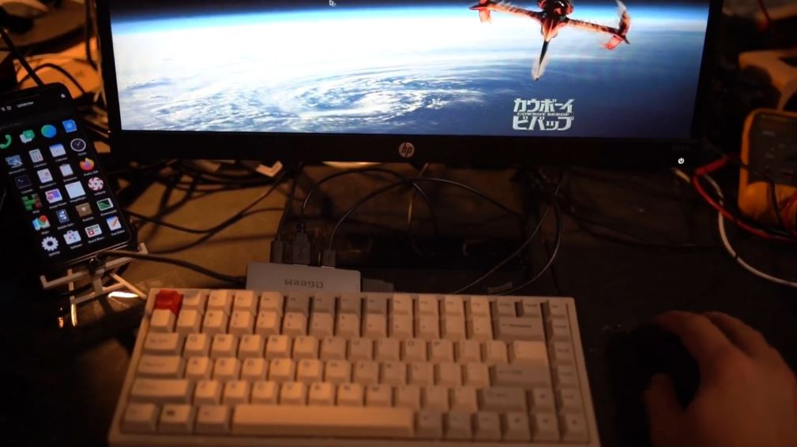
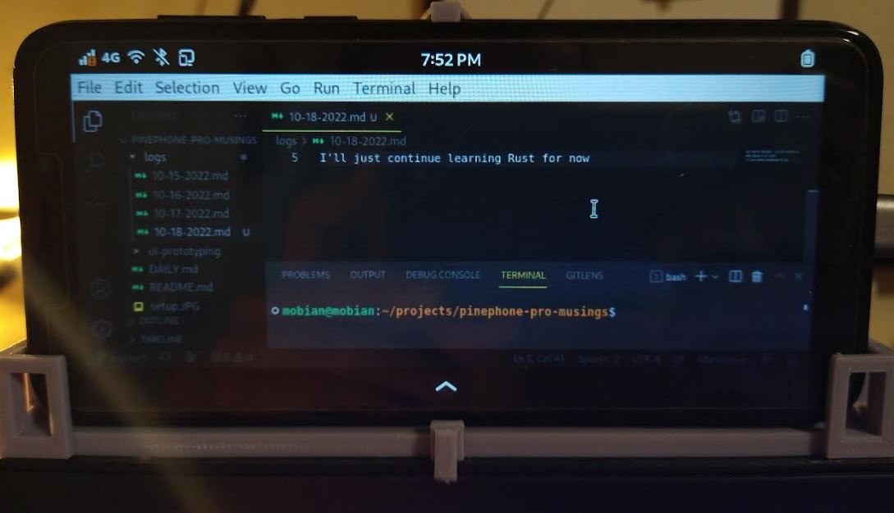
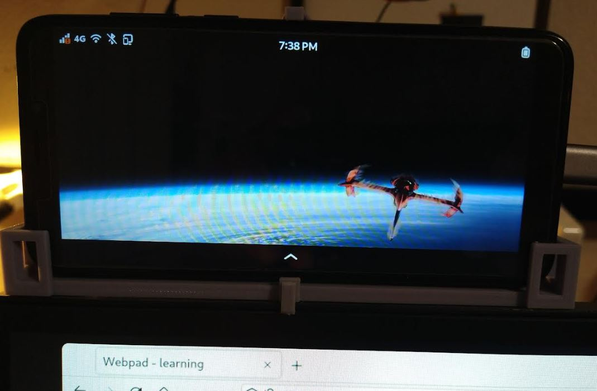

### About

Trying to use PinePhone Pro as a dev environment

### The setup

Keyboard is EPOMAKER EP84

The monitor is an HP Pavilion 21.5in IPS LED HDMI 1080P. It's a convenient design being a rectangle when viewed from the side.

The case I [designed](https://github.com/jdc-cunningham/crud-pinephone-app/blob/master/monitor-phone-as-webcam-stand/model-stl.stl), the Pinephone Pro just snaps right in, it's nice.

Listen to this [sound](https://youtu.be/oUS52Lfekdo?t=307).

### responsive design

Or just screen scaling I guess

### backgrounds

this image is not mine

### working
- AUX out (headphones)

### iffy

- bluetooth binding (Mobian/Phosh to speaker)

### misc

[run chromium](https://wiki.mobian-project.org/doku.php?id=chromium)

`flatpak run org.chromium.Chromium --enable-features=UseOzonePlatform --ozone-platform=wayland`

