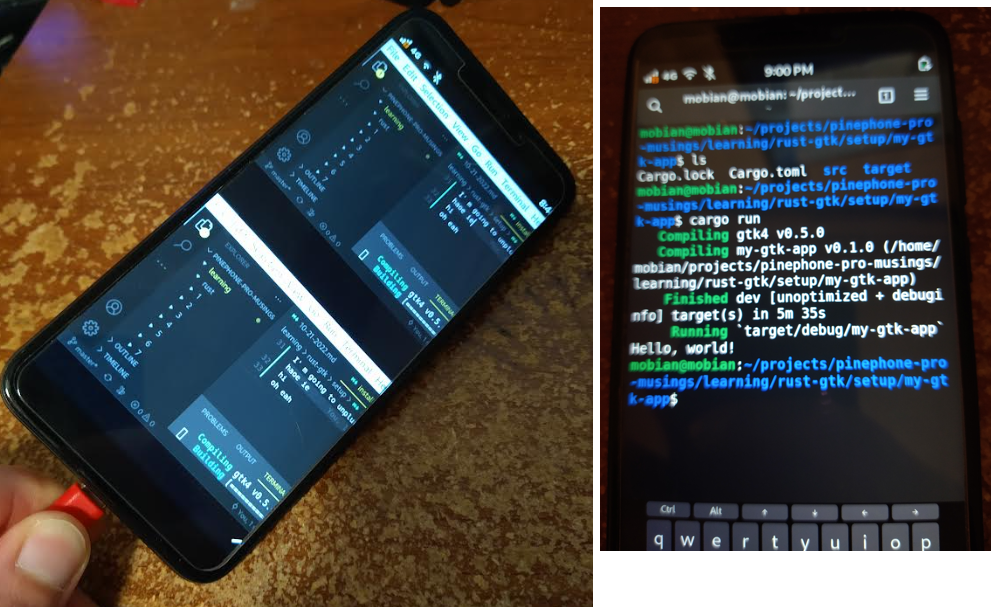

I went ahead and bought 4 different brands of USB-C to HDMI with PD support (usb power in).

That will charge the Pinephone Pro as it is docked.

I am going to rework the stand... because I have found that if you nudge the cable and the docked mode stops... I usually have to restart the phone... so I'll just have a normal portrait dock that you have by the base of the monitor. I'll design and 3D print a basic stand.

I also bought some L-shaped USB-C adapter things for the standing dock.

I liked the top-mounted display since the webcam is eyelevel. But the webcam isn't really usable right now.

For today I'm just going to review the Rust syntax that I have seen.

So the `&'static` thing is a named lifetime, this one static is duration of the program

`->` is function pointer type

Damn... this is a bit to know

`&expr` borrow, combinations eg. `&type` borrowed pointer type

`::` is path separator

yeah there is GTK and rust combination

I am unfortunately a note taker... that's how I get things to stick and also future reference... so note taking apps are something I can build more than once.

I guess I'll keep going with the learning

Oh damn... I've only been reading the first page of these sections ha

Will have to go back dang

Going to skip around

Yeah this would not have made it, the compile time is suspect too, not sure if it's pheasable

It was about 10 minutes in total not 5... because the phone froze midway, (the stacked/split VS code image) but thankfully rerunning `cargo run` picked back up at 114/116