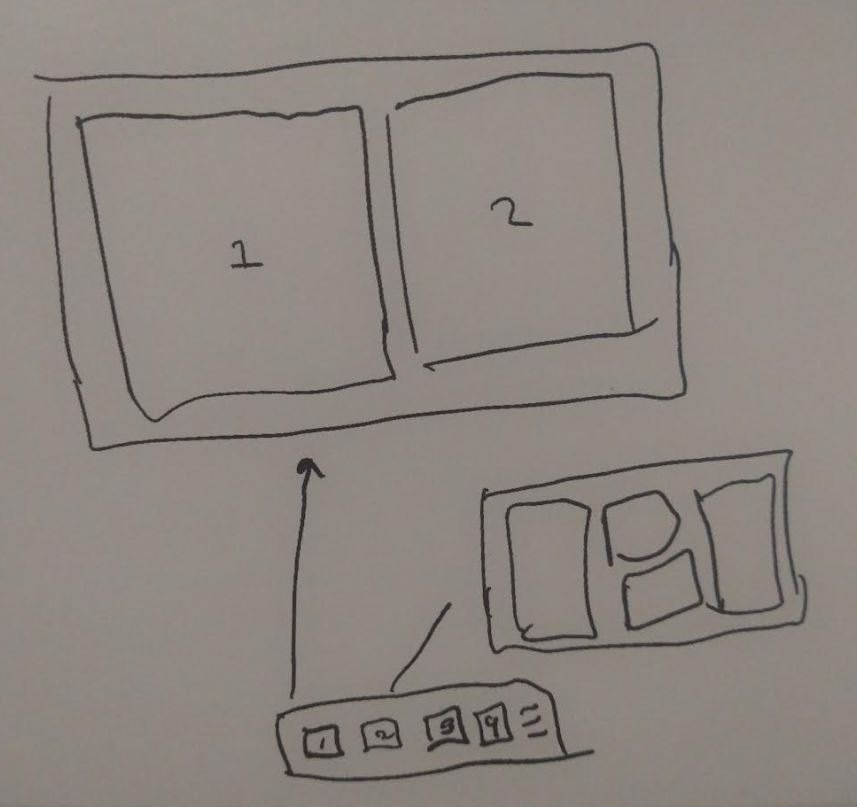

just doing some reading today

I did have a thought for a potential rust app to make, it would be a config/app launcher

so like I want a split set of two apps, configure it

that could be interesting

it is an app launcher really, specify what opens, size/location on screen, save that configuration

This thing would be at the bottom of the external monitor