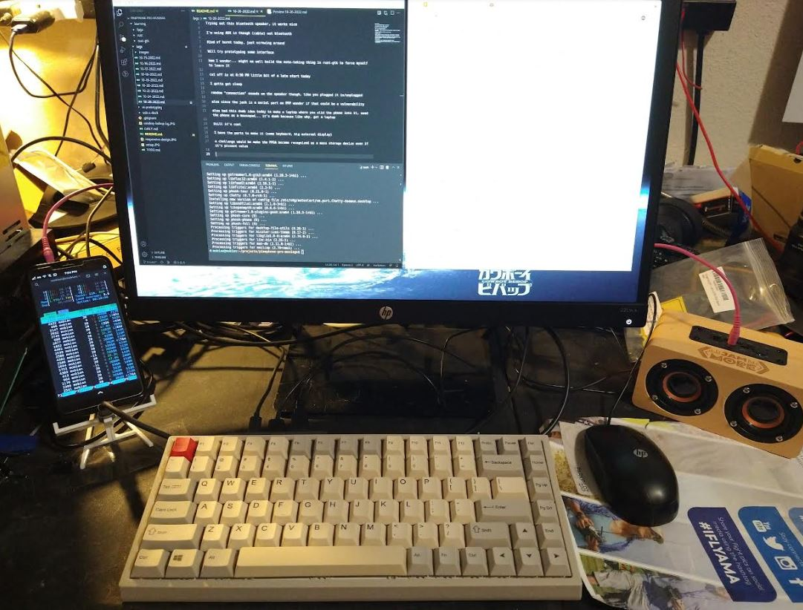

Start 7:35 PM

Trying out this bluetooth speaker, it works nice

I'm using AUX in though (cable) not bluetooth

Kind of burnt today, just screwing around

Will try prototyping some interface

hmm I wonder... might as well build the note-taking thing in rust-gtk to force myself to learn it

cut off is at 8:30 PM little bit of a late start today

I gotta get sleep

random "connection" sounds on the speaker though, like you plugged it in/unplugged

also since the jack is a serial port on PPP wonder if that could be a vulnerability

also had this dumb idea today to make a laptop where you slid the phone into it, used the phone as a mousepad... it's dumb because like why, get a laptop

Still it's cool

I have the parts to make it (some keyboard, big external display)

a challenge would be make the FPGA become recognized as a mass storage device even if it's pissant value

I'm trying to think of this thing, this engine

not a mechanical one a digital one

it just keeps going

you feed it

how does it grow

ugh... no matter what I learn I always feel like an amateur

sure very shallow depth of knowledge most things that aren't JS/web that's true

had a fail today, thought today was 27 for some reason moved some things around ugh...

oh well

my god this forced mobile mode of firefox is annoying

it's not the window scale, will see if I can get chromium on mobian, it's not in apt

https://forum.pine64.org/showthread.php?tid=13235

looks like it's through flatpak, hmm sounds like it's problematic too ehh

the picture in frame thing isn't intentional but kind of cool

https://wiki.mobian-project.org/doku.php?id=chromium

hehe spinning \ for processing indicator in CLI is cool

It's doing this

```
        ID                                      Branch     Op     Remote      Download
 1. [✓] org.chromium.Chromium.Codecs            stable     i      flathub         1.0 MB / 1.0 MB
 2. [✓] org.chromium.Chromium.Locale            stable     i      flathub       131.4 kB / 112.8 kB
 3. [✓] org.freedesktop.Platform.GL.default     21.08      i      flathub       100.6 MB / 100.1 MB
 4. [\] org.freedesktop.Platform.Locale         21.08      i      flathub        81.2 MB / 326.3 MB
 5. [ ] org.freedesktop.Platform                21.08      i      flathub     < 196.5 MB
 6. [ ] org.chromium.Chromium                   stable     i      flathub     < 130.8 MB
```

All 6 cores being used between 70-90%

Good thing my SD card is 128GB

Also for notetaking apps (future ones) I will use local storage so they're not useless if some network is down (rare)

As in sqlite practice

hmm can't launch Chromium by clicking on the icon

might be because of the wayland thing

anyway I can work with that, store the run command in terminal history/somewhere

it's worth it, the mobile firefox experience is awful with regard to YouTube/SoundCloud

holy crap the cursor is tiny in chromium lol, the text is clear though

damn it is slow though, well I closed Firefox and it improved

I'll try it out

but I have a volume bar in YT again

well that's it for today

The setup today, taken before Chromium stuff



